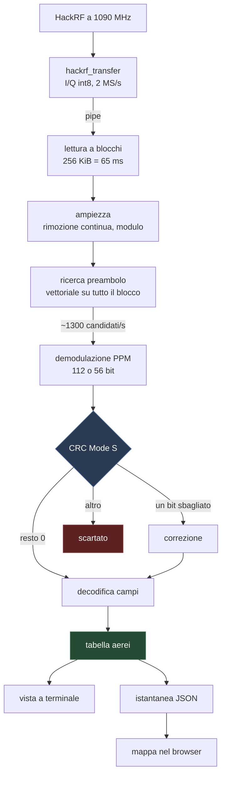
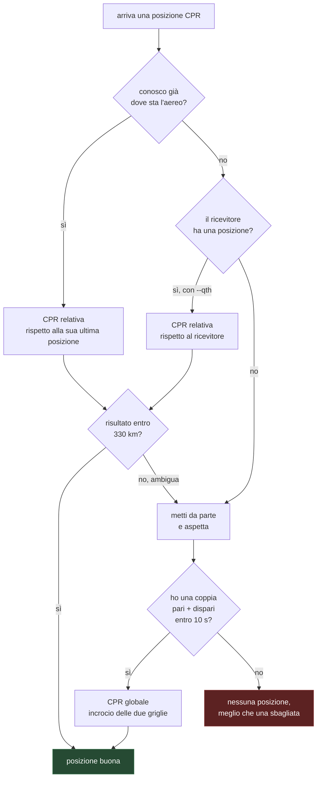
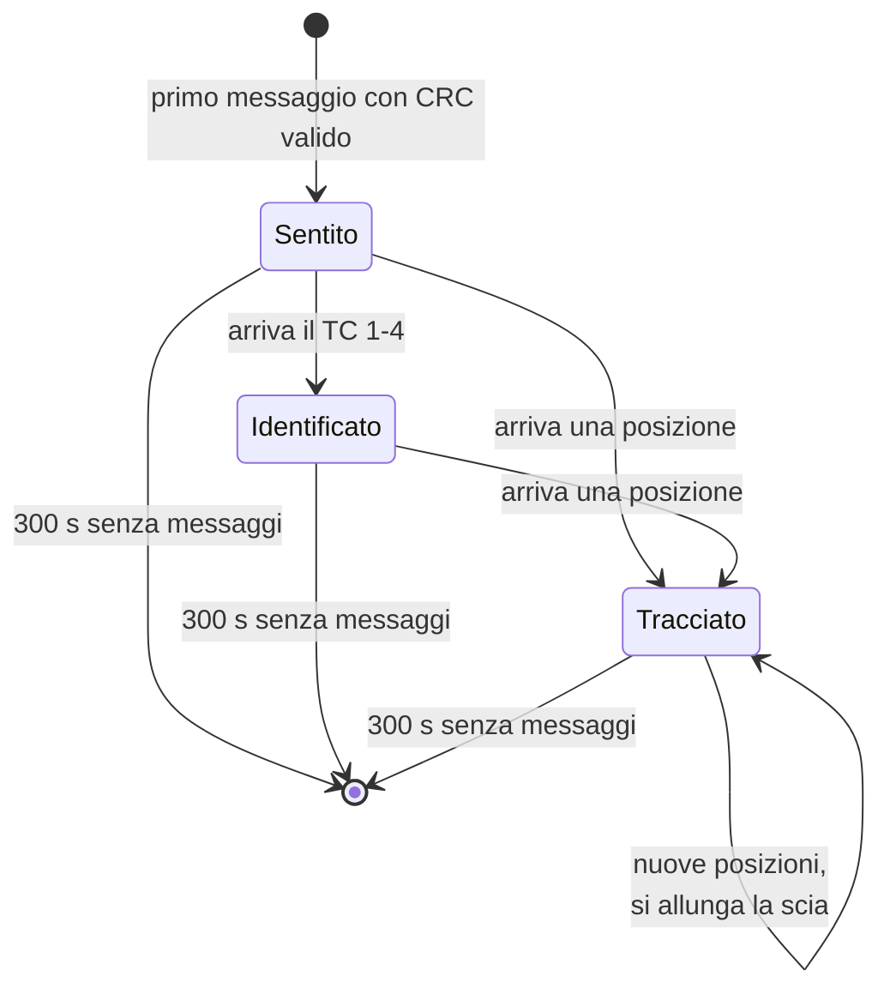
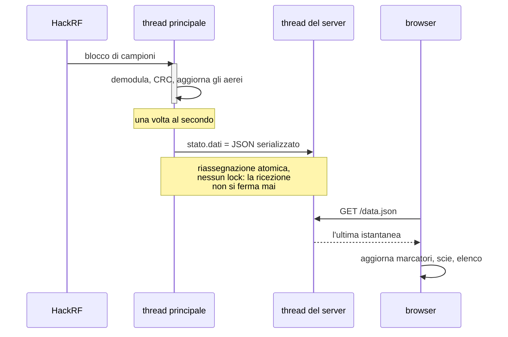
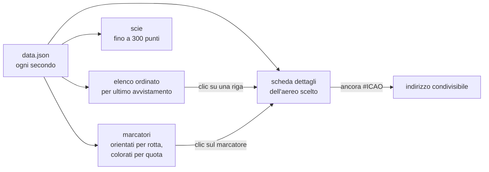

# Come funziona, per schemi

Documento di riferimento per capire la forma del programma senza leggerne il
codice. Il perché delle scelte sta in [decisioni/](decisioni/).

## 1. La catena completa



Il collo di bottiglia è la ricerca del preambolo, che gira su ogni campione: è
tutta in numpy. Dal blocco "demodulazione" in poi si lavora solo sui candidati
sopravvissuti, quindi Python puro basta e avanza.

## 2. Che forma ha un messaggio

Ogni bit dura 1 µs e si divide in due mezzi bit da 0,5 µs: **primo alto** vuol
dire `1`, **secondo alto** vuol dire `0`. A 2 MS/s ogni mezzo bit è un campione.

```
        preambolo, 8 µs                 dati, 112 µs (o 56)
   ┌───────────────────────────┐ ┌──────────────────────────────┐

   █   █         █   █                █ ▁   ▁ █   █ ▁   ▁ █
   0   1  2  3   4   5  6  7  8       0     1     0     1
   └─┬─┘                              └──┬──┘
     │                                   │
  impulsi a 0, 1, 3.5, 4.5 µs        un bit = 2 campioni

campione:  0 1 2 3 4 5 6 7 8 9 ... 15 │ 16 17 │ 18 19 │ ...
livello:   █ ▁ █ ▁ ▁ ▁ ▁ █ ▁ █ ▁ ▁ ▁▁ │  █ ▁  │  ▁ █  │
                                       └─ 1 ─┘ └─ 0 ─┘
```

La firma cercata è proprio questa: quattro campioni alti nelle posizioni 0, 2,
7, 9, con tutto il resto che ricade sotto. Sono dieci confronti, applicati in
blocco a tutto l'array.

## 3. Cosa c'è dentro ai 112 bit

```
 ┌────────┬──────────────────┬──────────────────────────────┬────────────┐
 │ DF  CA │       ICAO       │              ME              │   parità   │
 │  5   3 │        24        │              56              │     24     │
 └────────┴──────────────────┴──────────────────────────────┴────────────┘
   byte 0      byte 1-3                byte 4-10              byte 11-13

 il campo ME, in base ai suoi primi 5 bit (type code):

   TC 1-4    identificativo di volo, 8 caratteri da 6 bit + categoria
   TC 5-8    posizione al suolo, velocità di rullaggio
   TC 9-18   posizione in volo + quota barometrica
   TC 19     velocità, rotta, rateo di salita
   TC 20-22  posizione in volo + quota satellitare
```

## 4. Dalla posizione compressa alla posizione vera

Le coordinate viaggiano in CPR, che da solo è ambiguo. Il programma prova la
strada più corta disponibile:



## 5. Vita di un aereo nella tabella



Un aereo compare nell'elenco appena supera il CRC, anche senza posizione: nella
tabella si vede l'indirizzo e il livello di segnale. Quota, identificativo e
posizione arrivano da messaggi diversi e si accumulano man mano.

## 6. I due thread e come si passano i dati



Il thread di decodifica non deve fermarsi ad aspettare nessuno: se si blocca,
si perdono campioni e quindi messaggi. Per questo non condivide la struttura
degli aerei con il server, ma gliene passa una fotografia già pronta.

## 7. La pagina della mappa



## Dove sta cosa nel sorgente

| sezione | contenuto |
|---|---|
| parametri radio | frequenza, ritmo di campionamento, dimensioni derivate |
| CRC Mode S | tabella del polinomio, tabelle delle sindromi, correzione |
| decodifica dei campi | identificativo, quota, velocità, CPR, distanze |
| stato degli aerei | `Aereo`, `Decoder` |
| demodulazione | `Demodulatore`: ampiezza, preambolo, bit |
| mappa web | pagina HTML, istantanea, server |
| autotest | controlli rapidi su messaggi noti |
| main | opzioni, sorgente, ciclo principale |
